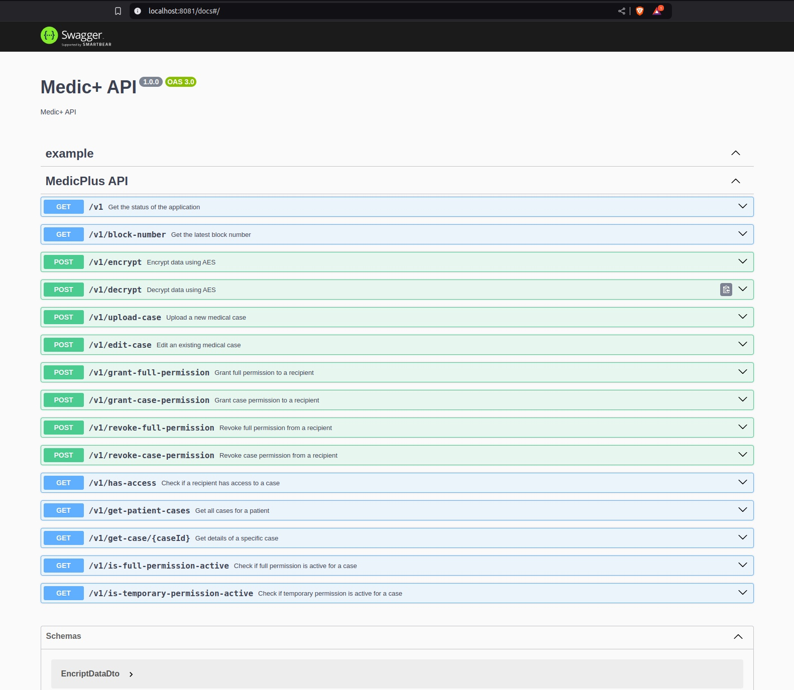
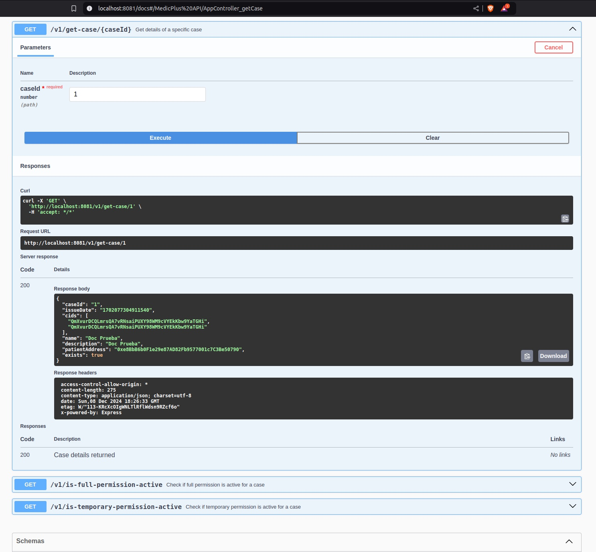

# Medic+

**Medic+** es una solución descentralizada diseñada para transformar la gestión y el control de los historiales médicos personales. Basada en tecnología blockchain, garantiza la privacidad y seguridad de los datos, otorgando a los pacientes el control total sobre quién puede acceder a su información y en qué momento.

Con **Medic+**, compartir datos médicos de forma cómoda y segura se convierte en una realidad, permitiendo a los pacientes acceder a todas las posibilidades que ofrece la telemedicina y la prevención avanzada. Esto incluye la facilidad de obtener segundas opiniones o realizar estudios preventivos con cualquier clínica o especialista, tanto de manera presencial como online.

Además, **Medic+** integra un innovador asistente de inteligencia artificial capaz de traducir diagnósticos médicos en términos claros y comprensibles. Este asistente también sugiere estudios adicionales o cambios en los hábitos de vida basados en normativas internacionales, como las guías de la Organización Mundial de la Salud (OMS). Todo esto se realiza con un enfoque en la privacidad del usuario y un análisis avanzado de sus datos médicos.

**Medic+** no solo empodera a los pacientes, sino que también establece un nuevo estándar en la gestión de información médica al combinar seguridad, accesibilidad e innovación tecnológica.

### Tecnologías Utilizadas

Este proyecto utiliza las siguientes tecnologías:

- **Node.js**: Entorno de ejecución para JavaScript que permite construir aplicaciones del lado del servidor.
- **NestJS**: Framework para construir aplicaciones eficientes y escalables del lado del servidor con Node.js.
- **TypeScript**: Superconjunto de JavaScript que añade tipos estáticos y otras características avanzadas.
- **Ethers.js**: Librería para interactuar con la blockchain de Ethereum, utilizada para la gestión de contratos inteligentes.
- **Jest**: Framework de pruebas de JavaScript que permite realizar tests unitarios y de integración.
- **Swagger**: Herramienta para documentar APIs RESTful de manera interactiva.
- **Crypto-JS**: Librería de JavaScript que proporciona algoritmos de cifrado estándar.
- **Pinata**: Servicio para almacenar y gestionar archivos en la red IPFS (InterPlanetary File System).

### Documentacion de las APIs desarrolladas
- **APIs Documentation**: Medic+ cuenta con una documentacion de sus APIs para facilitar la adopcion y aporte de los entusiastas





### Contribuir

Estamos abiertos a contribuciones de la comunidad. Si deseas colaborar, por favor sigue los pasos descritos anteriormente para clonar el repositorio e instalar las dependencias. Asegúrate de seguir las mejores prácticas de desarrollo y de revisar el código antes de enviar un pull request.

1. Clona este repositorio:
   ```bash
   git clone https://github.com/EducatEth-Medic/MedicPlus-Backtend.git
   ```

2. Navega al directorio del proyecto:

   ```bash
   cd MedicPlus-Backtend
   ```

3. Instala las dependencias necesarias:

   ```bash
   npm install
   ```

4. Crea un archivo de entorno `.env` guiandote de las llaves en `.env.example.development` y configura las claves necesarias para la blockchain y el IPFS.

5. Inicia el servidor de desarrollo:

   ```bash
   npm run start:dev
   ```